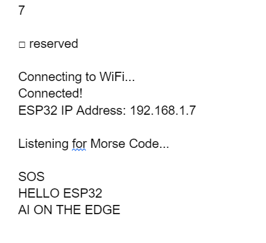

# Wi-Fi Digital Telegraph: Python to ESP32 Morse Code Decoder

This project bridges the gap between classic communication and modern IoT. It transforms your laptop into an automated digital telegraph that transmits Morse code signals over Wi-Fi via UDP packets. An ESP32 microcontroller receives these signals, measures the timings and silences in real-time, and decodes the Morse code back into readable English text.

## 🚀 How It Works

Instead of sending clean text strings (like `SOS`), this project mimics the physical physics of a telegraph key:
1. **The Transmitter (Python):** A Python script calculates the exact millisecond duration of "dots" and "dashes" and sends those durations as UDP packets to the ESP32. It also simulates the standard International Morse Code silence intervals between symbols, letters, and words.
2. **The Receiver (ESP32):** The ESP32 listens for these UDP packets on your local Wi-Fi network.
3. **The Decoder (C++):** Using non-blocking timers (`millis()`), the ESP32 tracks the incoming signal durations and the silences between them to reconstruct the Morse characters and translate them into English on the Serial Monitor.

## 🛠️ Hardware & Software Requirements

### Hardware
* **ESP32 Development Board** (e.g., NodeMCU ESP32, ESP32 WROOM)
* Micro-USB or USB-C cable (for programming and power)
* A Laptop or Desktop computer
* A local Wi-Fi router (both devices must be on the same network)

### Software
* **Arduino IDE** (with the ESP32 board manager installed)
* **Python 3.x** installed on your computer

## ⚙️ Setup Instructions

### Step 1: Configure and Flash the ESP32
1. Open the Arduino IDE and create a new sketch.
2. Copy the C++ Receiver code into the sketch.
3. Modify the network credentials at the top of the file to match your home Wi-Fi:
   ```cpp
   const char* ssid = "YOUR_WIFI_NAME";
   const char* password = "YOUR_WIFI_PASSWORD";
   ```
4.Connect your ESP32 to your computer, select the correct COM port and ESP32 board in the Arduino IDE, and click Upload.

5.Once uploaded, open the Serial Monitor (set baud rate to 300).

6.Press the EN (reset) button on your ESP32. It will connect to your Wi-Fi and print its local IP address. Write this IP address down.

### Step 2: Configure the Python Transmitter
Create a new folder on your computer and save the Python Transmitter script as sender.py.

Open sender.py in a text editor and update the ESP32_IP variable with the IP address you got from the Serial Monitor in Step 1:

Python
ESP32_IP = "192.168.1.50"  # Replace with your actual ESP32 IP
(Optional) Edit the sample_sentences array at the bottom of the script to send your own custom messages!

### ▶️ Running the Project
Ensure your ESP32 is powered on and the Arduino Serial Monitor is open and listening.

Open a terminal or command prompt on your computer.

Navigate to the folder where you saved telegraph.py.

Run the script:

Bash
python sender.py
Watch the terminal as Python transmits the signals, and look at the Arduino Serial Monitor as your ESP32 decodes the incoming UDP packets into English in real-time!


